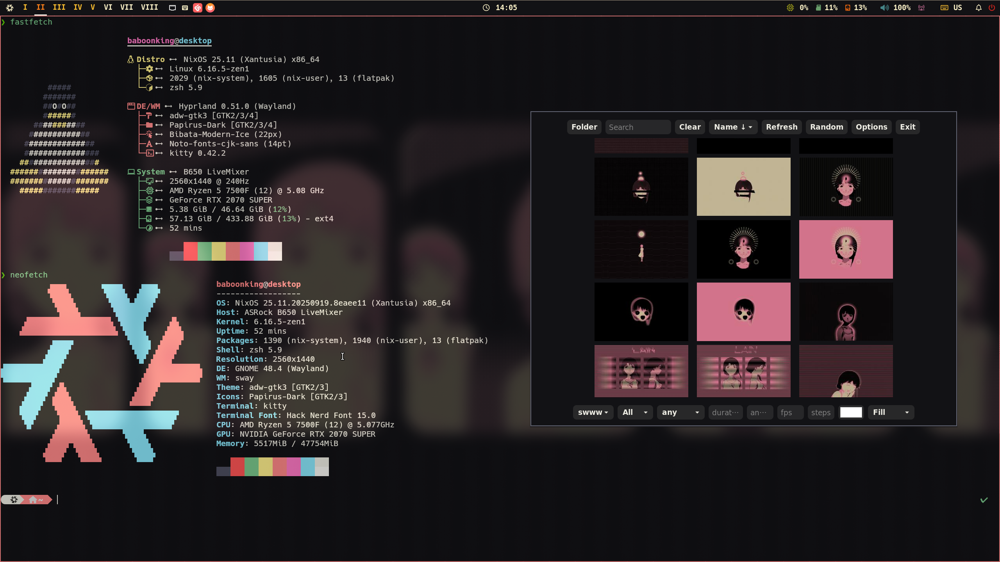

# LainOS

是我目前nixOS的配置备份
有时间会来完善

**nixvim**

**fastfetch && neofetch**

## 即将添加功能

### debug
- 修复rofi和vicinae输入法问题

### nvim 
- noice插件
- 美化

### 添加功能
- 完善swaync通知栏
- 完善clash-verge-dev
- 完善cherry-studio更新
- 完善gnome插件
- qt/gtk主题设置
- hyprland美化

### code 环境布置
- kilocode/cline/roocode
- 完成devenv环境配置

### nix配置
- 源加速
- nh
- flake
